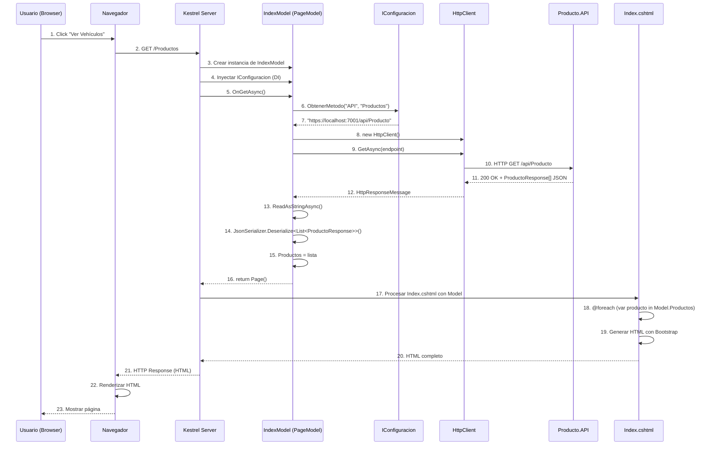

# Razor Pages - Listar Vehículos (Index)

## 📘 Página de Listado

Este documento explica la implementación de la **página principal para listar todos los vehículos** usando Razor Pages.

---

## 🎯 Objetivo

Mostrar una lista de todos los vehículos registrados con opciones para ver detalle, editar y eliminar.

**URL**: `/Productos` o `/Productos/Index`

**Método**: GET

---

## 🔄 Flujo Completo Server-Side



---

## 💻 Implementación

### 1. PageModel (Backend C#)

```csharp
// Pages/Productos/Index.cshtml.cs
using Microsoft.AspNetCore.Mvc.RazorPages;
using System.Text.Json;
using Abstracciones.Modelos;
using Abstracciones.Interfaces.Reglas;

namespace Productos.WEB.Pages.Productos
{
    /// <summary>
    /// PageModel para la página de listado de vehículos.
    /// </summary>
    public class IndexModel : PageModel
    {
        private readonly IConfiguracion _configuracion;

        /// <summary>
        /// Lista de vehículos a mostrar en la vista.
        /// </summary>
        public List<ProductoResponse> Productos { get; set; } = new List<ProductoResponse>();

        /// <summary>
        /// Indica si hubo un error al cargar los datos.
        /// </summary>
        public bool HayError { get; set; } = false;

        /// <summary>
        /// Mensaje de error si lo hay.
        /// </summary>
        public string MensajeError { get; set; } = string.Empty;

        public IndexModel(IConfiguracion configuracion)
        {
            _configuracion = configuracion;
        }

        /// <summary>
        /// Maneja la request GET inicial.
        /// Obtiene los vehículos desde el API.
        /// </summary>
        public async Task OnGetAsync()
        {
            try
            {
                // 1. Obtener endpoint desde configuración
                string endpoint = _configuracion.ObtenerMetodo("API", "Productos");

                // 2. Crear HttpClient
                using var cliente = new HttpClient();

                // 3. Crear y enviar request
                var solicitud = new HttpRequestMessage(HttpMethod.Get, endpoint);
                var respuesta = await cliente.SendAsync(solicitud);

                // 4. Verificar código de estado
                if (respuesta.StatusCode == System.Net.HttpStatusCode.NoContent)
                {
                    // 204: No hay vehículos
                    Productos = new List<ProductoResponse>();
                    return;
                }

                // 5. Lanzar excepción si no es exitoso
                respuesta.EnsureSuccessStatusCode();

                // 6. Leer y deserializar JSON
                var contenido = await respuesta.Content.ReadAsStringAsync();

                Productos = JsonSerializer.Deserialize<List<ProductoResponse>>(contenido, new JsonSerializerOptions
                {
                    PropertyNameCaseInsensitive = true
                }) ?? new List<ProductoResponse>();
            }
            catch (HttpRequestException ex)
            {
                // Error de conexión con el API
                HayError = true;
                MensajeError = $"Error al conectar con el servidor: {ex.Message}";
            }
            catch (JsonException ex)
            {
                // Error al deserializar JSON
                HayError = true;
                MensajeError = $"Error al procesar los datos: {ex.Message}";
            }
            catch (Exception ex)
            {
                // Cualquier otro error
                HayError = true;
                MensajeError = $"Error inesperado: {ex.Message}";
            }
        }
    }
}
```

**Características**:
- ✅ Hereda de `PageModel`
- ✅ Propiedades públicas accesibles desde la vista
- ✅ `OnGetAsync()`: Handler para GET requests
- ✅ Manejo de errores completo
- ✅ Manejo de 204 No Content

---

### 2. Vista Razor (Frontend HTML + C#)

```html
@* Pages/Productos/Index.cshtml *@
@page
@model Productos.WEB.Pages.Productos.IndexModel
@{
    ViewData["Title"] = "Vehículos";
}

<!-- Header con botón Agregar -->
<div class="container mt-4">
    <div class="row mb-4">
        <div class="col-md-8">
            <h1 class="display-4">
                <i class="bi bi-car-front-fill text-primary"></i> 
                Gestión de Vehículos
            </h1>
            <p class="lead text-muted">Lista completa de vehículos registrados</p>
        </div>
        <div class="col-md-4 text-end d-flex align-items-center justify-content-end">
            <a asp-page="./Agregar" class="btn btn-primary btn-lg shadow">
                <i class="bi bi-plus-circle"></i> Agregar Vehículo
            </a>
        </div>
    </div>

    <!-- Manejo de errores -->
    @if (Model.HayError)
    {
        <div class="alert alert-danger alert-dismissible fade show" role="alert">
            <i class="bi bi-exclamation-triangle-fill"></i>
            <strong>Error:</strong> @Model.MensajeError
            <button type="button" class="btn-close" data-bs-dismiss="alert"></button>
        </div>
    }

    <!-- Mensaje si no hay vehículos -->
    @if (!Model.HayError && !Model.Productos.Any())
    {
        <div class="alert alert-info shadow-sm">
            <i class="bi bi-info-circle-fill"></i>
            <strong>No hay vehículos registrados.</strong>
            <a asp-page="./Agregar" class="alert-link">Agregar el primero</a>.
        </div>
    }

    <!-- Grid de vehículos con Bootstrap Cards -->
    @if (Model.Productos.Any())
    {
        <div class="row">
            <div class="col-12 mb-3">
                <p class="text-muted">
                    <i class="bi bi-list-ul"></i> 
                    Mostrando <strong>@Model.Productos.Count</strong> vehículos
                </p>
            </div>
        </div>

        <div class="row row-cols-1 row-cols-md-2 row-cols-lg-3 g-4">
            @foreach (var producto in Model.Productos)
            {
                <div class="col">
                    <div class="card h-100 shadow-sm hover-shadow transition">
                        <!-- Header con marca y modelo -->
                        <div class="card-header bg-primary text-white">
                            <h5 class="card-title mb-0">
                                <i class="bi bi-car-front"></i>
                                @producto.Marca @producto.Modelo
                            </h5>
                        </div>

                        <!-- Body con información -->
                        <div class="card-body">
                            <dl class="row mb-0">
                                <dt class="col-5">Placa:</dt>
                                <dd class="col-7">
                                    <span class="badge bg-secondary">@producto.Placa</span>
                                </dd>

                                <dt class="col-5">Color:</dt>
                                <dd class="col-7">@producto.Color</dd>

                                <dt class="col-5">Año:</dt>
                                <dd class="col-7">@producto.Anio</dd>

                                <dt class="col-5">Precio:</dt>
                                <dd class="col-7">
                                    <strong class="text-success">
                                        @producto.Precio.ToString("C", new System.Globalization.CultureInfo("es-CO"))
                                    </strong>
                                </dd>

                                <dt class="col-5">Propietario:</dt>
                                <dd class="col-7 small text-muted">
                                    <i class="bi bi-envelope"></i> @producto.CorreoPropietario
                                </dd>
                            </dl>
                        </div>

                        <!-- Footer con acciones -->
                        <div class="card-footer bg-transparent">
                            <div class="btn-group w-100" role="group">
                                <a asp-page="./Detalle" 
                                   asp-route-id="@producto.Id" 
                                   class="btn btn-sm btn-info text-white"
                                   title="Ver detalle">
                                    <i class="bi bi-info-square"></i> Ver
                                </a>

                                <a asp-page="./Editar" 
                                   asp-route-id="@producto.Id" 
                                   class="btn btn-sm btn-warning"
                                   title="Editar vehículo">
                                    <i class="bi bi-pencil-square"></i> Editar
                                </a>

                                <a asp-page="./Eliminar" 
                                   asp-route-id="@producto.Id" 
                                   class="btn btn-sm btn-danger"
                                   title="Eliminar vehículo">
                                    <i class="bi bi-trash"></i> Eliminar
                                </a>
                            </div>
                        </div>
                    </div>
                </div>
            }
        </div>
    }
</div>

@* CSS personalizado *@
@section Styles {
    <style>
        .hover-shadow {
            transition: box-shadow 0.3s ease;
        }
        
        .hover-shadow:hover {
            box-shadow: 0 0.5rem 1rem rgba(0, 0, 0, 0.15) !important;
        }
        
        .transition {
            transition: transform 0.2s ease;
        }
        
        .transition:hover {
            transform: translateY(-5px);
        }
    </style>
}
```

**Elementos Razor**:
- ✅ `@page`: Define que es una Razor Page
- ✅ `@model`: Especifica el tipo de PageModel
- ✅ `Model.Propiedad`: Accede a propiedades del PageModel
- ✅ `asp-page`: Tag Helper para navegación entre páginas
- ✅ `asp-route-id`: Pasa parámetro en la URL
- ✅ `@foreach`: Loop en C# embebido
- ✅ `@if`: Condicionales en C#
- ✅ `@section Styles`: Define sección para el layout

---

## 🎨 Tag Helpers Explicados

### asp-page

```html
<!-- Genera URL relativa a otra Razor Page -->
<a asp-page="./Agregar">Agregar</a>
<!-- Resultado: <a href="/Productos/Agregar">Agregar</a> -->
```

### asp-route-{parametro}

```html
<!-- Pasa parámetros en la URL -->
<a asp-page="./Detalle" asp-route-id="@producto.Id">Ver</a>
<!-- Resultado: <a href="/Productos/Detalle/12345678-...">Ver</a> -->
```

**Ventaja**: ASP.NET Core genera las URLs automáticamente, no hardcoding.

---

## ⚙️ Configuración (appsettings.json)

```json
{
  "API": {
    "Productos": "https://localhost:7001/api/Producto",
    "Marcas": "https://localhost:7001/api/Marca",
    "Modelos": "https://localhost:7001/api/Modelo"
  }
}
```

### IConfiguracion

```csharp
// Reglas/Configuracion.cs
public class Configuracion : IConfiguracion
{
    private readonly IConfiguration _configuration;

    public Configuracion(IConfiguration configuration)
    {
        _configuration = configuration;
    }

    public string ObtenerMetodo(string seccion, string metodo)
    {
        return _configuration[$"{seccion}:{metodo}"];
    }
}
```

**Uso**:
```csharp
string url = _configuracion.ObtenerMetodo("API", "Productos");
// Resultado: "https://localhost:7001/api/Producto"
```

---

## 📊 Comparación con React

| Aspecto | **Razor Pages (Index)** | **React (ProductosPage)** |
|---------|------------------------|---------------------------|
| **Rendering** | Server-Side | Client-Side |
| **Data Fetching** | `OnGetAsync()` en servidor | `useEffect() + fetch()` en cliente |
| **Estado** | No persiste (nueva request = nuevo PageModel) | Persiste en memoria (`useState`) |
| **Loading** | Mientras servidor procesa (~200ms) | Spinner en UI explícito |
| **Navegación** | Full page reload | Sin reload (React Router) |
| **SEO** | ✅ HTML completo desde inicio | ⚠️ Requiere SSR |
| **Primera carga** | ✅ Rápida | ⚠️ Descarga JS bundle |
| **UI Framework** | Bootstrap 5 | Tailwind CSS |
| **Interactividad** | ⚠️ Requiere JavaScript adicional | ✅ Por defecto |
| **Paginación** | En servidor | En cliente |

---

## 🚀 Performance

### Optimizaciones

```csharp
// 1. Caché en PageModel
[ResponseCache(Duration = 60)] // Cache 1 minuto
public async Task OnGetAsync()
{
    // ...
}

// 2. HttpClient reutilizable
private static readonly HttpClient _httpClient = new HttpClient();

// 3. Streaming para listas grandes
public async IAsyncEnumerable<ProductoResponse> ObtenerProductosStreaming()
{
    // Yield return conforme se obtienen
}
```

---

## 🧪 Testing

```csharp
// Productos.WEB.Tests/IndexModelTests.cs
public class IndexModelTests
{
    [Fact]
    public async Task OnGetAsync_APIRetornaProductos_CargaLista()
    {
        // Arrange
        var mockConfig = new Mock<IConfiguracion>();
        mockConfig.Setup(c => c.ObtenerMetodo("API", "Productos"))
                  .Returns("https://api-test/productos");

        var model = new IndexModel(mockConfig.Object);

        // Mockear HttpClient es complejo, usar WebApplicationFactory
        
        // Act
        await model.OnGetAsync();

        // Assert
        Assert.NotNull(model.Productos);
    }
}
```

---

## 📚 Documentos Relacionados

- **[Web - Agregar Vehículo](./02-web-post-crear-producto.md)** - Crear nuevo
- **[Web - Detalle Vehículo](./03-web-get-detalle-producto.md)** - Ver uno específico
- **[Web - Arquitectura General](./productos-web-arquitectura.md)** - Visión completa

---

**Siguiente**: [02 - Agregar Vehículo (Crear)](./02-web-post-crear-producto.md)

