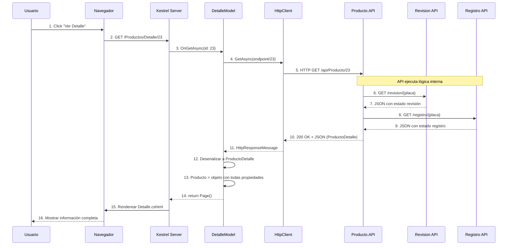

# Razor Pages - Detalle de Vehículo (Read by ID)

## 📘 Página de Detalle Completo

Este documento explica la implementación de la **página de visualización detallada de un vehículo específico**.

---

## 🎯 Objetivo

Mostrar toda la información de un vehículo en formato legible, incluyendo validaciones externas.

**URL**: `/Productos/Detalle/{id}`

**Método**: **GET**

---

## 🔄 Flujo Completo



---

## 💻 Implementación

### 1. PageModel con Route Parameter

```csharp
// Pages/Productos/Detalle.cshtml.cs
using Microsoft.AspNetCore.Mvc;
using Microsoft.AspNetCore.Mvc.RazorPages;
using System.Text.Json;
using Abstracciones.Modelos;
using Abstracciones.Interfaces.Reglas;

namespace Productos.WEB.Pages.Productos
{
    public class DetalleModel : PageModel
    {
        private readonly IConfiguracion _configuracion;

        /// <summary>
        /// ⭐ Objeto completo con todas las propiedades enriquecidas.
        /// </summary>
        public ProductoDetalle? Producto { get; set; }

        public bool HayError { get; set; } = false;
        public string MensajeError { get; set; } = string.Empty;

        public DetalleModel(IConfiguracion configuracion)
        {
            _configuracion = configuracion;
        }

        /// <summary>
        /// GET: Cargar detalle de un vehículo específico.
        /// El parámetro 'id' viene desde la URL (/Detalle/23).
        /// </summary>
        public async Task<IActionResult> OnGetAsync(int id)
        {
            try
            {
                // 1. Obtener endpoint
                string endpoint = _configuracion.ObtenerMetodo("API", "Productos");

                using var cliente = new HttpClient();

                // 2. ⭐ Llamar al API con /id
                var respuesta = await cliente.GetAsync($"{endpoint}/{id}");

                // 3. Verificar status
                if (respuesta.StatusCode == System.Net.HttpStatusCode.NotFound)
                {
                    HayError = true;
                    MensajeError = $"Vehículo con ID {id} no encontrado";
                    return Page();
                }

                respuesta.EnsureSuccessStatusCode();

                // 4. Deserializar a ProductoDetalle
                var json = await respuesta.Content.ReadAsStringAsync();
                Producto = JsonSerializer.Deserialize<ProductoDetalle>(json, new JsonSerializerOptions
                {
                    PropertyNameCaseInsensitive = true
                });

                // 5. Verificar que no sea null
                if (Producto == null)
                {
                    HayError = true;
                    MensajeError = "No se pudo obtener la información del vehículo";
                    return Page();
                }

                return Page();
            }
            catch (HttpRequestException ex)
            {
                HayError = true;
                MensajeError = $"Error de conexión: {ex.Message}";
                return Page();
            }
            catch (Exception ex)
            {
                HayError = true;
                MensajeError = $"Error inesperado: {ex.Message}";
                return Page();
            }
        }
    }
}
```

**Características clave**:
- ✅ Parámetro `id` desde la URL
- ✅ Manejo de 404 Not Found
- ✅ Deserialización a `ProductoDetalle` (con propiedades extra)
- ✅ Error handling completo

---

### 2. Modelo ProductoDetalle

```csharp
// Abstracciones/Modelos/ProductoDetalle.cs
namespace Abstracciones.Modelos
{
    /// <summary>
    /// ⭐ Modelo extendido con validaciones externas.
    /// Incluye propiedades que no están en la BD, pero se obtienen del API.
    /// </summary>
    public class ProductoDetalle
    {
        // Propiedades básicas
        public int Id { get; set; }
        public string Placa { get; set; }
        public string Color { get; set; }
        public int Anio { get; set; }
        public decimal Precio { get; set; }
        public string CorreoPropietario { get; set; }
        public string TelefonoPropietario { get; set; }

        // Relaciones
        public int IdModelo { get; set; }
        public string NombreModelo { get; set; }
        public int IdMarca { get; set; }
        public string NombreMarca { get; set; }

        // ⭐ Validaciones externas (enriquecimiento)
        public string EstadoRevision { get; set; } = "NO_ENCONTRADO";
        public DateTime? FechaRevision { get; set; }
        public string EstadoRegistro { get; set; } = "NO_ENCONTRADO";
        public DateTime? FechaRegistro { get; set; }
    }
}
```

---

### 3. Vista Razor con Badges

```html
@* Pages/Productos/Detalle.cshtml *@
@page "{id:int}"
@model Productos.WEB.Pages.Productos.DetalleModel
@{
    ViewData["Title"] = $"Detalle - {Model.Producto?.Placa ?? ""}";
}

<div class="container mt-4">
    <!-- Header con breadcrumb -->
    <div class="row mb-4">
        <div class="col">
            <h1 class="display-5">
                <i class="bi bi-info-circle text-info"></i> 
                Detalle del Vehículo
            </h1>
            <nav aria-label="breadcrumb">
                <ol class="breadcrumb">
                    <li class="breadcrumb-item"><a asp-page="./Index">Vehículos</a></li>
                    <li class="breadcrumb-item active">Detalle</li>
                </ol>
            </nav>
        </div>
    </div>

    @if (Model.HayError)
    {
        <!-- Error state -->
        <div class="alert alert-danger">
            <i class="bi bi-exclamation-triangle-fill"></i>
            <strong>Error:</strong> @Model.MensajeError
        </div>
        <a asp-page="./Index" class="btn btn-secondary">
            <i class="bi bi-arrow-left"></i> Volver al listado
        </a>
    }
    else if (Model.Producto != null)
    {
        <!-- Success state: Mostrar detalle -->
        <div class="row">
            <div class="col-lg-8 mx-auto">
                <div class="card shadow-lg">
                    <!-- Card header con placa -->
                    <div class="card-header bg-primary text-white">
                        <h3 class="mb-0">
                            <i class="bi bi-credit-card-2-front"></i>
                            Placa: @Model.Producto.Placa
                        </h3>
                    </div>

                    <div class="card-body p-4">
                        <!-- ⭐ Sección: Información Básica -->
                        <h4 class="border-bottom pb-2 mb-3">
                            <i class="bi bi-info-square"></i> Información Básica
                        </h4>
                        
                        <dl class="row">
                            <dt class="col-sm-4">Color:</dt>
                            <dd class="col-sm-8">
                                <span class="badge" style="background-color: @Model.Producto.Color;">
                                    @Model.Producto.Color
                                </span>
                            </dd>

                            <dt class="col-sm-4">Año:</dt>
                            <dd class="col-sm-8">@Model.Producto.Anio</dd>

                            <dt class="col-sm-4">Precio:</dt>
                            <dd class="col-sm-8">
                                <strong class="text-success">
                                    $@Model.Producto.Precio.ToString("N2")
                                </strong>
                            </dd>
                        </dl>

                        <hr class="my-4" />

                        <!-- ⭐ Sección: Marca y Modelo -->
                        <h4 class="border-bottom pb-2 mb-3">
                            <i class="bi bi-car-front"></i> Marca y Modelo
                        </h4>

                        <dl class="row">
                            <dt class="col-sm-4">Marca:</dt>
                            <dd class="col-sm-8">
                                <span class="badge bg-secondary fs-6">
                                    @Model.Producto.NombreMarca
                                </span>
                            </dd>

                            <dt class="col-sm-4">Modelo:</dt>
                            <dd class="col-sm-8">
                                <span class="badge bg-info fs-6">
                                    @Model.Producto.NombreModelo
                                </span>
                            </dd>
                        </dl>

                        <hr class="my-4" />

                        <!-- ⭐ Sección: Datos del Propietario -->
                        <h4 class="border-bottom pb-2 mb-3">
                            <i class="bi bi-person-vcard"></i> Datos del Propietario
                        </h4>

                        <dl class="row">
                            <dt class="col-sm-4">Correo:</dt>
                            <dd class="col-sm-8">
                                <a href="mailto:@Model.Producto.CorreoPropietario">
                                    <i class="bi bi-envelope"></i>
                                    @Model.Producto.CorreoPropietario
                                </a>
                            </dd>

                            <dt class="col-sm-4">Teléfono:</dt>
                            <dd class="col-sm-8">
                                <a href="tel:@Model.Producto.TelefonoPropietario">
                                    <i class="bi bi-telephone"></i>
                                    @Model.Producto.TelefonoPropietario
                                </a>
                            </dd>
                        </dl>

                        <hr class="my-4" />

                        <!-- ⭐ Sección: Validaciones Externas (Enriquecimiento) -->
                        <h4 class="border-bottom pb-2 mb-3">
                            <i class="bi bi-shield-check"></i> Validaciones y Registros
                        </h4>

                        <div class="row g-3">
                            <!-- Estado de Revisión Técnica -->
                            <div class="col-md-6">
                                <div class="card border-@(Model.Producto.EstadoRevision == "VIGENTE" ? "success" : "warning")">
                                    <div class="card-body">
                                        <h6 class="card-title">
                                            <i class="bi bi-gear"></i> Revisión Técnica
                                        </h6>
                                        @if (Model.Producto.EstadoRevision == "VIGENTE")
                                        {
                                            <span class="badge bg-success">
                                                <i class="bi bi-check-circle"></i> VIGENTE
                                            </span>
                                        }
                                        else if (Model.Producto.EstadoRevision == "VENCIDA")
                                        {
                                            <span class="badge bg-danger">
                                                <i class="bi bi-x-circle"></i> VENCIDA
                                            </span>
                                        }
                                        else
                                        {
                                            <span class="badge bg-secondary">
                                                <i class="bi bi-question-circle"></i> NO ENCONTRADO
                                            </span>
                                        }

                                        @if (Model.Producto.FechaRevision.HasValue)
                                        {
                                            <p class="small mb-0 mt-2">
                                                Fecha: @Model.Producto.FechaRevision.Value.ToString("dd/MM/yyyy")
                                            </p>
                                        }
                                    </div>
                                </div>
                            </div>

                            <!-- Estado de Registro Propiedad -->
                            <div class="col-md-6">
                                <div class="card border-@(Model.Producto.EstadoRegistro == "VIGENTE" ? "success" : "warning")">
                                    <div class="card-body">
                                        <h6 class="card-title">
                                            <i class="bi bi-file-earmark-text"></i> Registro de Propiedad
                                        </h6>
                                        @if (Model.Producto.EstadoRegistro == "VIGENTE")
                                        {
                                            <span class="badge bg-success">
                                                <i class="bi bi-check-circle"></i> VIGENTE
                                            </span>
                                        }
                                        else if (Model.Producto.EstadoRegistro == "PENDIENTE")
                                        {
                                            <span class="badge bg-warning">
                                                <i class="bi bi-hourglass"></i> PENDIENTE
                                            </span>
                                        }
                                        else
                                        {
                                            <span class="badge bg-secondary">
                                                <i class="bi bi-question-circle"></i> NO ENCONTRADO
                                            </span>
                                        }

                                        @if (Model.Producto.FechaRegistro.HasValue)
                                        {
                                            <p class="small mb-0 mt-2">
                                                Fecha: @Model.Producto.FechaRegistro.Value.ToString("dd/MM/yyyy")
                                            </p>
                                        }
                                    </div>
                                </div>
                            </div>
                        </div>
                    </div>

                    <!-- Card footer con acciones -->
                    <div class="card-footer bg-light">
                        <div class="d-flex justify-content-between">
                            <a asp-page="./Index" class="btn btn-secondary">
                                <i class="bi bi-arrow-left"></i> Volver
                            </a>
                            <div>
                                <a asp-page="./Editar" asp-route-id="@Model.Producto.Id" class="btn btn-warning">
                                    <i class="bi bi-pencil"></i> Editar
                                </a>
                                <a asp-page="./Eliminar" asp-route-id="@Model.Producto.Id" class="btn btn-danger">
                                    <i class="bi bi-trash"></i> Eliminar
                                </a>
                            </div>
                        </div>
                    </div>
                </div>
            </div>
        </div>
    }
</div>
```

**Elementos UI destacados**:
- ✅ `<dl>/<dt>/<dd>`: Lista de definiciones (semántico)
- ✅ Badges dinámicos según estado (success/danger/warning)
- ✅ Íconos Bootstrap Icons
- ✅ Tarjetas para validaciones externas

---

## 🎨 Route Parameter en @page

```html
@page "{id:int}"
```

Este directive hace que el PageModel reciba automáticamente el parámetro `id`:

```
/Productos/Detalle/23  →  id = 23
/Productos/Detalle/abc →  404 Not Found (no es int)
```

```csharp
// En el PageModel
public async Task<IActionResult> OnGetAsync(int id)
{
    // 'id' viene automáticamente desde la URL
}
```

---

## 🔍 Comparación con React

| Aspecto | Razor Pages | React |
|---------|------------|-------|
| **Routing** | `/Detalle/{id}` en `@page` | `/productos/:id` en React Router |
| **Obtener parámetro** | `OnGetAsync(int id)` | `const { id } = useParams()` |
| **Fetch data** | HttpClient en PageModel | `useEffect(() => fetch())` |
| **Renderizado** | Server-side (HTML completo) | Client-side (JSON → JSX) |
| **Estado inicial** | Ya viene con datos | Loading state necesario |
| **SEO** | ✅ Perfecto (HTML en source) | ⚠️ Requiere SSR |
| **Validaciones** | Ya enriquecidas en API | Enriquecidas en API también |

---

## 🧪 Ejemplo de Respuesta del API

```json
{
  "id": 23,
  "placa": "ABC-123",
  "color": "Rojo",
  "anio": 2022,
  "precio": 25000.00,
  "correoPropietario": "juan@example.com",
  "telefonoPropietario": "555-1234",
  "idModelo": 5,
  "nombreModelo": "Corolla",
  "idMarca": 2,
  "nombreMarca": "Toyota",
  "estadoRevision": "VIGENTE",
  "fechaRevision": "2024-12-01T00:00:00",
  "estadoRegistro": "VIGENTE",
  "fechaRegistro": "2023-05-15T00:00:00"
}
```

---

## 📚 Documentos Relacionados

- **[API - GET Detalle](../../Producto.API/docs/02-api-get-detalle-producto.md)** - Endpoint consumido
- **[Web - Editar](./04-web-put-editar-producto.md)** - Acción siguiente típica

---

**Siguiente**: [04 - Editar Vehículo](./04-web-put-editar-producto.md)

