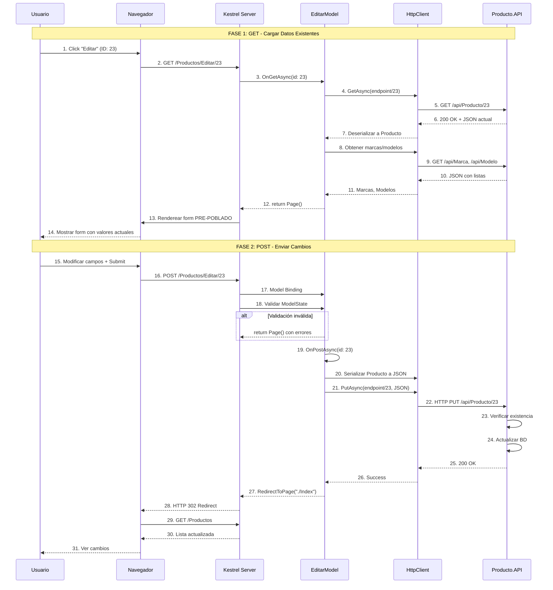

# Razor Pages - Editar Vehículo (Update)

## 📘 Página de Edición

Este documento explica la implementación de la **página para editar un vehículo existente** con formulario pre-poblado.

---

## 🎯 Objetivo

Permitir al usuario modificar los datos de un vehículo existente.

**URL**: `/Productos/Editar/{id}`

**Métodos**: 
- **GET**: Cargar form con datos actuales
- **POST**: Enviar cambios al API

---

## 🔄 Flujo Completo (GET + POST)



---

## 💻 Implementación

### 1. PageModel con GET y POST

```csharp
// Pages/Productos/Editar.cshtml.cs
using Microsoft.AspNetCore.Mvc;
using Microsoft.AspNetCore.Mvc.RazorPages;
using System.Text;
using System.Text.Json;
using Abstracciones.Modelos;
using Abstracciones.Interfaces.Reglas;

namespace Productos.WEB.Pages.Productos
{
    public class EditarModel : PageModel
    {
        private readonly IConfiguracion _configuracion;

        /// <summary>
        /// ⭐ [BindProperty] con SupportsGet = false (solo POST).
        /// </summary>
        [BindProperty]
        public ProductoRequest Producto { get; set; } = new();

        /// <summary>
        /// ⭐ El ID NO se debe editar, viene de la URL.
        /// </summary>
        public int Id { get; set; }

        /// <summary>
        /// Listas para dropdowns.
        /// </summary>
        public List<Marca> Marcas { get; set; } = new();
        public List<Modelo> Modelos { get; set; } = new();

        public string MensajeError { get; set; } = string.Empty;

        public EditarModel(IConfiguracion configuracion)
        {
            _configuracion = configuracion;
        }

        /// <summary>
        /// GET: Cargar datos actuales del vehículo.
        /// </summary>
        public async Task<IActionResult> OnGetAsync(int id)
        {
            Id = id;

            try
            {
                string endpoint = _configuracion.ObtenerMetodo("API", "Productos");

                using var cliente = new HttpClient();

                // 1. ⭐ Obtener datos actuales
                var respuesta = await cliente.GetAsync($"{endpoint}/{id}");

                if (respuesta.StatusCode == System.Net.HttpStatusCode.NotFound)
                {
                    MensajeError = $"Vehículo {id} no encontrado";
                    return Page();
                }

                respuesta.EnsureSuccessStatusCode();

                var json = await respuesta.Content.ReadAsStringAsync();
                var productoActual = JsonSerializer.Deserialize<ProductoResponse>(json, new JsonSerializerOptions
                {
                    PropertyNameCaseInsensitive = true
                });

                // 2. ⭐ Mapear a ProductoRequest (para binding con form)
                Producto = new ProductoRequest
                {
                    IdModelo = productoActual.IdModelo,
                    Placa = productoActual.Placa,
                    Color = productoActual.Color,
                    Anio = productoActual.Anio,
                    Precio = productoActual.Precio,
                    CorreoPropietario = productoActual.CorreoPropietario,
                    TelefonoPropietario = productoActual.TelefonoPropietario
                };

                // 3. Cargar marcas/modelos para dropdowns
                await CargarDatosFormulario();

                return Page();
            }
            catch (Exception ex)
            {
                MensajeError = $"Error al cargar vehículo: {ex.Message}";
                return Page();
            }
        }

        /// <summary>
        /// POST: Enviar cambios al API.
        /// </summary>
        public async Task<IActionResult> OnPostAsync(int id)
        {
            Id = id;

            // 1. Validación
            if (!ModelState.IsValid)
            {
                await CargarDatosFormulario();
                return Page();
            }

            try
            {
                string endpoint = _configuracion.ObtenerMetodo("API", "Productos");

                using var cliente = new HttpClient();

                // 2. Serializar objeto modificado
                var json = JsonSerializer.Serialize(Producto, new JsonSerializerOptions
                {
                    PropertyNamingPolicy = JsonNamingPolicy.CamelCase
                });

                var content = new StringContent(json, Encoding.UTF8, "application/json");

                // 3. ⭐ PUT request con /id
                var respuesta = await cliente.PutAsync($"{endpoint}/{id}", content);

                // 4. Verificar respuesta
                if (respuesta.StatusCode == System.Net.HttpStatusCode.NotFound)
                {
                    MensajeError = $"Vehículo {id} no encontrado";
                    await CargarDatosFormulario();
                    return Page();
                }

                if (!respuesta.IsSuccessStatusCode)
                {
                    var error = await respuesta.Content.ReadAsStringAsync();
                    MensajeError = $"Error del servidor: {respuesta.StatusCode} - {error}";
                    await CargarDatosFormulario();
                    return Page();
                }

                // 5. ⭐ POST-Redirect-GET pattern
                TempData["Mensaje"] = "Vehículo actualizado exitosamente";
                TempData["TipoMensaje"] = "success";
                return RedirectToPage("./Index");
            }
            catch (HttpRequestException ex)
            {
                MensajeError = $"Error de conexión: {ex.Message}";
                await CargarDatosFormulario();
                return Page();
            }
            catch (Exception ex)
            {
                MensajeError = $"Error inesperado: {ex.Message}";
                await CargarDatosFormulario();
                return Page();
            }
        }

        /// <summary>
        /// Helper para cargar opciones de marcas/modelos.
        /// </summary>
        private async Task CargarDatosFormulario()
        {
            try
            {
                using var cliente = new HttpClient();

                var endpointMarcas = _configuracion.ObtenerMetodo("API", "Marcas");
                var respuestaMarcas = await cliente.GetAsync(endpointMarcas);
                respuestaMarcas.EnsureSuccessStatusCode();
                var jsonMarcas = await respuestaMarcas.Content.ReadAsStringAsync();
                Marcas = JsonSerializer.Deserialize<List<Marca>>(jsonMarcas, new JsonSerializerOptions
                {
                    PropertyNameCaseInsensitive = true
                }) ?? new List<Marca>();

                var endpointModelos = _configuracion.ObtenerMetodo("API", "Modelos");
                var respuestaModelos = await cliente.GetAsync(endpointModelos);
                respuestaModelos.EnsureSuccessStatusCode();
                var jsonModelos = await respuestaModelos.Content.ReadAsStringAsync();
                Modelos = JsonSerializer.Deserialize<List<Modelo>>(jsonModelos, new JsonSerializerOptions
                {
                    PropertyNameCaseInsensitive = true
                }) ?? new List<Modelo>();
            }
            catch
            {
                Marcas = new List<Marca>();
                Modelos = new List<Modelo>();
            }
        }
    }
}
```

**Características clave**:
- ✅ `OnGetAsync(int id)`: Carga datos actuales del API
- ✅ `OnPostAsync(int id)`: Envía cambios con PUT
- ✅ Mapeo: `ProductoResponse` → `ProductoRequest`
- ✅ ID separado (no editable) vs propiedades editables

---

## 🎯 Pattern: Mapeo Response → Request

```csharp
// GET devuelve Response (incluye datos calculados)
var productoActual = JsonSerializer.Deserialize<ProductoResponse>(json);

// Mapear manualmente a Request (solo campos editables)
Producto = new ProductoRequest
{
    IdModelo = productoActual.IdModelo,
    Placa = productoActual.Placa,
    Color = productoActual.Color,
    Anio = productoActual.Anio,
    Precio = productoActual.Precio,
    CorreoPropietario = productoActual.CorreoPropietario,
    TelefonoPropietario = productoActual.TelefonoPropietario
};
```

**Razón**: `Response` tiene campos como `NombreMarca`, `NombreModelo` que no se envían al actualizar.

---

### 2. Vista Razor con Pre-Población

```html
@* Pages/Productos/Editar.cshtml *@
@page "{id:int}"
@model Productos.WEB.Pages.Productos.EditarModel
@{
    ViewData["Title"] = $"Editar - {Model.Producto?.Placa ?? ""}";
}

<div class="container mt-4">
    <!-- Header -->
    <div class="row mb-4">
        <div class="col">
            <h1 class="display-5">
                <i class="bi bi-pencil-square text-warning"></i> 
                Editar Vehículo - ID: @Model.Id
            </h1>
            <nav aria-label="breadcrumb">
                <ol class="breadcrumb">
                    <li class="breadcrumb-item"><a asp-page="./Index">Vehículos</a></li>
                    <li class="breadcrumb-item active">Editar</li>
                </ol>
            </nav>
        </div>
    </div>

    <!-- Error -->
    @if (!string.IsNullOrEmpty(Model.MensajeError))
    {
        <div class="alert alert-danger alert-dismissible fade show">
            <i class="bi bi-exclamation-triangle-fill"></i>
            <strong>Error:</strong> @Model.MensajeError
            <button type="button" class="btn-close" data-bs-dismiss="alert"></button>
        </div>
    }

    <!-- Formulario -->
    <div class="row">
        <div class="col-lg-8 mx-auto">
            <div class="card shadow">
                <div class="card-body p-4">
                    <form method="post">
                        <!-- ⭐ Hidden field para preservar ID -->
                        <input type="hidden" name="id" value="@Model.Id" />

                        <div asp-validation-summary="ModelOnly" class="alert alert-danger"></div>

                        <!-- Campo: Modelo (Dropdown PRE-SELECCIONADO) -->
                        <div class="mb-3">
                            <label asp-for="Producto.IdModelo" class="form-label">
                                <i class="bi bi-car-front"></i> Modelo *
                            </label>
                            <select asp-for="Producto.IdModelo" class="form-select">
                                <option value="">-- Seleccione un modelo --</option>
                                @foreach (var marca in Model.Marcas)
                                {
                                    <optgroup label="@marca.Nombre">
                                        @foreach (var modelo in Model.Modelos.Where(m => m.IdMarca == marca.Id))
                                        {
                                            <!-- ⭐ asp-for genera automáticamente 'selected' si coincide -->
                                            <option value="@modelo.Id">@modelo.Nombre</option>
                                        }
                                    </optgroup>
                                }
                            </select>
                            <span asp-validation-for="Producto.IdModelo" class="text-danger small"></span>
                        </div>

                        <!-- Campo: Placa (PRE-POBLADO) -->
                        <div class="mb-3">
                            <label asp-for="Producto.Placa" class="form-label">
                                <i class="bi bi-credit-card-2-front"></i> Placa *
                            </label>
                            <!-- ⭐ asp-for automáticamente establece 'value' -->
                            <input asp-for="Producto.Placa" class="form-control" maxlength="10" />
                            <span asp-validation-for="Producto.Placa" class="text-danger small"></span>
                        </div>

                        <!-- Campo: Color -->
                        <div class="mb-3">
                            <label asp-for="Producto.Color" class="form-label">
                                <i class="bi bi-palette"></i> Color *
                            </label>
                            <input asp-for="Producto.Color" class="form-control" />
                            <span asp-validation-for="Producto.Color" class="text-danger small"></span>
                        </div>

                        <!-- Campo: Año -->
                        <div class="mb-3">
                            <label asp-for="Producto.Anio" class="form-label">
                                <i class="bi bi-calendar3"></i> Año *
                            </label>
                            <input asp-for="Producto.Anio" type="number" class="form-control" />
                            <span asp-validation-for="Producto.Anio" class="text-danger small"></span>
                        </div>

                        <!-- Campo: Precio -->
                        <div class="mb-3">
                            <label asp-for="Producto.Precio" class="form-label">
                                <i class="bi bi-currency-dollar"></i> Precio *
                            </label>
                            <input asp-for="Producto.Precio" type="number" step="0.01" class="form-control" />
                            <span asp-validation-for="Producto.Precio" class="text-danger small"></span>
                        </div>

                        <!-- Campo: Correo Propietario -->
                        <div class="mb-3">
                            <label asp-for="Producto.CorreoPropietario" class="form-label">
                                <i class="bi bi-envelope"></i> Correo del Propietario *
                            </label>
                            <input asp-for="Producto.CorreoPropietario" type="email" class="form-control" />
                            <span asp-validation-for="Producto.CorreoPropietario" class="text-danger small"></span>
                        </div>

                        <!-- Campo: Teléfono Propietario -->
                        <div class="mb-3">
                            <label asp-for="Producto.TelefonoPropietario" class="form-label">
                                <i class="bi bi-telephone"></i> Teléfono del Propietario *
                            </label>
                            <input asp-for="Producto.TelefonoPropietario" type="tel" class="form-control" />
                            <span asp-validation-for="Producto.TelefonoPropietario" class="text-danger small"></span>
                        </div>

                        <hr class="my-4" />

                        <!-- Botones -->
                        <div class="d-flex justify-content-between">
                            <button type="submit" class="btn btn-warning btn-lg">
                                <i class="bi bi-save"></i> Guardar Cambios
                            </button>
                            <a asp-page="./Index" class="btn btn-secondary btn-lg">
                                <i class="bi bi-x-circle"></i> Cancelar
                            </a>
                        </div>
                    </form>
                </div>
            </div>
        </div>
    </div>
</div>

@section Scripts {
    <partial name="_ValidationScriptsPartial" />
}
```

**Tag Helper mágico**: `asp-for` automáticamente:
- ✅ Establece `value="..."` con el dato actual
- ✅ Marca `selected` en `<select>` si coincide
- ✅ Genera atributos `name`, `id`, `data-val`

---

## 🔄 PUT vs POST en HttpClient

```csharp
// ❌ Este código es INCORRECTO para editar
await cliente.PostAsync($"{endpoint}/{id}", content); 
// POST debería usarse solo para crear

// ✅ Correcto: PUT para actualizar
await cliente.PutAsync($"{endpoint}/{id}", content);
```

**Diferencias**:

| Método | Propósito | Idempotente | Location Header |
|--------|-----------|-------------|-----------------|
| **POST** | Crear nuevo | ❌ No | ✅ Sí (201) |
| **PUT** | Actualizar existente | ✅ Sí | ❌ No (200) |

---

## 🎯 Idempotencia de PUT

```
PUT /api/Producto/23 con { "color": "Rojo" }
→ Resultado: Vehículo 23 tiene color Rojo

PUT /api/Producto/23 con { "color": "Rojo" } (segunda vez)
→ Resultado: Vehículo 23 SIGUE teniendo color Rojo (mismo estado)
```

**Idempotente** = Ejecutar múltiples veces produce el mismo resultado.

---

## 🔍 Comparación: Agregar vs Editar

| Aspecto | **Agregar** | **Editar** |
|---------|-------------|------------|
| **OnGet** | Form vacío (solo cargar marcas/modelos) | Cargar datos del API para pre-poblar |
| **OnPost** | POST a `/api/Producto` | PUT a `/api/Producto/{id}` |
| **Model Binding** | `[BindProperty] Producto` | Igual, pero ID separado |
| **Hidden field** | ❌ No necesario | ✅ Necesario para ID |
| **Mapeo** | ❌ No | ✅ Sí (Response → Request) |
| **Respuesta API** | 201 Created + Location | 200 OK |

---

## 📚 Documentos Relacionados

- **[API - PUT Editar](../../Producto.API/docs/04-api-put-editar-producto.md)** - Endpoint consumido
- **[Web - Agregar](./02-web-post-crear-producto.md)** - Formulario similar pero sin pre-población

---

**Siguiente**: [05 - Eliminar Vehículo](./05-web-delete-eliminar-producto.md)

